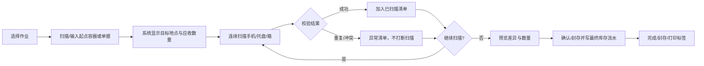

# 手机流转作业交互设计

> 本文是手机端/PC 端交互附录；岗位承接、权限、交接和记录时点的完整基线见 [《岗位 SOP、交接与权限设计》](ROLE_SOP_HANDOFF_DESIGN_2026-09-03.md)。两者冲突时，以后者的状态守卫和即时扫描事件规则为准。

## 设计目标

现场人员不需要理解“单据、库存流水、关系表”等系统概念，只需要按屏幕提示完成“扫描容器 → 连续扫描手机 → 检查异常 → 确认作业”。PC 与手机使用同一套作业状态和校验规则，区别仅在于布局：手机强调单手、扫码枪和不停顿；PC 强调批量导入、异常复核、预览和打印。

## 统一作业模型

所有收货、装盘、装箱、发运、调拨、维修退回都使用同一套 `作业会话`：

会话状态：`OPEN`（扫描中）、`PAUSED`（暂存）、`READY_TO_CONFIRM`（可确认）、`CONFIRMED`（已确认）、`CANCELLED`（已取消）。每次扫码立即保存不可变扫描事件和会话明细；装盘/装箱类作业同时形成可撤销的临时容器关系，拣货类作业形成预留。确认/封存/发出/收货时才完成相应的最终状态变更，所有变更写入不可变库存流水。

## 手机端页面

### 首页：今日作业

- 顶部固定显示当前人员、当前组织/地点、网络状态和未同步作业数。
- 主区域只显示当前权限可用且确实有待办的作业队列：收购验收、装入托盘、装入箱子、发运、到货/收货、门店调拨、维修退回、退回分诊和盘点；不把无待办的菜单堆给一线员工。
- 每个作业卡片显示“下一步动作”，例如“扫描发运单”或“扫描目标托盘”。不显示内部 API 名称。
- “继续未完成作业”置顶，避免人员离开页面后丢失现场进度。

### 作业页：三段式固定布局

1. **顶部上下文条**：作业名称、当前位置、目标地点、单据号/托盘号、暂停和退出。
2. **中部扫码区**：超大输入框/相机按钮；扫码成功自动清空并重新聚焦；IMEI 满 15 位可自动提交。
3. **底部结果区**：成功数量、应收/已收数量、容量进度、最近 5 条扫码记录、异常数量和“完成作业”按钮。

规则：成功扫码不弹窗；重复、位置不符、已在其他容器、IMEI 不存在等错误进入异常列表并短暂震动/变色提示，操作员可以继续下一台。

## 主要业务流程（覆盖七条主路径及其分支）

### 1. 深圳办公室：收购 → 验收 → 装托盘 → 装箱 → 发运

采用向导式连续作业，但允许在同一作业中暂停：

- **收购验收**：先选择供应商/地点，再连续扫描 IMEI；每台手机可快速选择成色、电池、价格，缺省值沿用上一台。
- **装入托盘**：先扫描托盘编码，显示托盘当前位置、容量和当前数量；之后连续扫描 IMEI。手机必须位于同一地点且未被其他托盘占用。
- **装入箱子**：先扫描箱子编码，再扫描一个或多个托盘编码；系统自动显示箱内手机总数，禁止把不同地点托盘混入箱子。
- **发运**：先扫描目标发运单/选择目的地，然后可混合扫描箱、托盘或单台 IMEI；扫描箱后自动展开其托盘和手机数量，页面显示“1 箱 / 3 托 / 120 台”。
- 完成发运前显示装载清单、预计数量、实际数量和异常项；确认后整批变为在途。

### 2. 加纳管理处：接收 → 开箱 → 开托盘 → 逐台验收 → 重装

- **接收登记**：扫描发运单或箱码，显示预计箱/托盘/手机数量。
- **开箱**：扫描箱码后点击“开封”；系统自动列出箱内托盘，不要求逐个重新录入。
- **开托盘**：扫描托盘码并点击“开封”；托盘进入“待验收”状态，手机清单成为待核对队列。
- **逐台验收**：操作员连续扫描实际 IMEI；系统自动对照预计清单，成功、缺失、多出、损坏分别计数。可一键将当前手机加入新托盘。
- **重装**：验收过程中可先扫描新托盘码，再连续把已验收手机装入；需要装箱时再扫描目标箱码和托盘码。
- 页面提供“只看未验收”“只看异常”“重新扫描异常”三个快捷入口。

### 3. 管理处 → 门店发运：箱、托盘或单台

- 发运作业第一步选择发送单位：箱 / 托盘 / 单台手机；默认记住上次选择。
- 扫描箱时视为整箱发运；扫描托盘时视为整托发运；扫描 IMEI 时视为单台发运。三者可以混合，但同一手机不能重复包含。
- 系统显示“外层容器已包含的手机”并自动去重，防止同时扫箱和箱内托盘造成重复发运。
- 目标门店以名称优先、代码次之；确认页明确显示“从管理处 → 某门店”。

### 4. 门店接收：开箱、开托盘、逐台清点验收

- 门店人员扫描调拨单/物流单后进入接收会话。
- 整箱到货先扫箱码，整托到货先扫托盘码；系统自动建立待收清单。
- 逐台扫描 IMEI 完成核对；缺失、串货、多货、破损都可以标记并拍照/备注，封签破损和严重异常在 P1 即要求照片/见证人。
- 接收完成前必须处理异常：确认差异、标记待复核或退回，不能静默结束。

### 5. 门店之间串货：单台、多台、托盘、箱

- “门店调拨”与“门店收货”使用同一套会话，只是方向不同。
- 发起方可扫描任意层级单位，系统自动展开数量并允许继续扫描其他层级。
- 接收方按实际到货层级核对；如果只收到箱内部分托盘，允许开箱后按托盘/IMEI 部分接收。
- 未确认的调拨可暂停；确认后生成完整的出库、在途、收货三段轨迹。

### 6. 门店维修/破损手机退回管理处

- 先选择退回原因：待维修 / 破损 / 其他；再扫描目标托盘编码，连续扫描 IMEI。
- 系统先记录退回意向、故障原因和目标管理处；确认退回发出后才进入“退回在途/破损隔离”，管理处逐台分诊后再决定“待维修、可再次销售、报废待批或待复核”。
- 扫描箱码后可把多个托盘装入箱；发运时支持整箱、整托、单台混合。
- 维修退回确认页显示原因分布和每个容器的手机数，避免把可售手机误装入退修箱。

### 7. 管理处接收退回：开箱 → 取托盘 → 逐台验收入库

- 扫描退回单/箱码进入“退回接收”会话，自动展示应收原因和数量。
- 开箱、开托盘后形成逐台待验队列；连续扫描 IMEI，逐台选择“维修入库 / 可再次销售 / 报废 / 待复核”。
- 验收完成后，系统要求选择最终存放托盘；扫描托盘编码后可把已验收手机连续装入。
- 对未扫到的手机生成缺失清单，对多出的手机生成待复核清单，只有处理异常后才能完成接收。

## PC 端页面

PC 端使用左侧“作业导航 + 中间会话工作区 + 右侧异常/摘要”布局：

- **作业导航**：按深圳、管理处、门店、维修退回分组，显示未完成数量。
- **会话工作区**：顶部步骤条；中部支持扫码枪、文本框、Excel/CSV 粘贴；底部显示明细表和批量操作。
- **右侧摘要**：应收、已扫、异常、容量、当前位置、目标地点；确认按钮固定在右下角。
- 支持打印托盘/箱标签、导出异常清单、按 IMEI 搜索并定位到会话。
- PC 不允许通过直接编辑表格绕过扫码校验；批量导入也必须逐行经过同一套校验。

## 防错设计

- 所有容器和手机都显示“当前位置”和“当前归属”，扫描后立即校验。
- 托盘/箱子使用明显的状态：空闲、装载中、已封存、在途、待验收、异常。
- 关键操作采用“短确认”而不是复杂弹窗：确认页只展示数量、方向、异常和最终按钮。
- 扫码枪输入框始终自动聚焦；网络断开时允许保存本地会话，恢复网络后按幂等键同步。
- 同一会话 + 同一 IMEI/容器建立唯一约束，重复扫码只返回已存在结果，不产生重复库存流水。
- 退出页面前若有未完成会话，提示“暂停并保存”，不直接丢弃。

## 建议的后端配套

- 新增 `container_work_sessions`、`container_work_items` 和容器状态/容量字段。
- 增加会话 API：`POST /work-sessions`、`POST /work-sessions/{id}/scan`、`GET /work-sessions/{id}`、`POST /work-sessions/{id}/pause`、`POST /work-sessions/{id}/confirm`。
- 现有一次性 `POST /inventory/trays`、`POST /inventory/boxes` 保留为兼容接口；新页面全部走会话 API。
- 发运、接收、调拨、维修退回共用“扫描容器自动展开”的服务，不在各业务模块重复实现。
- 继续保留不可变 `inventory_transactions`，并在扫描接受时写会话/关系事件；最终确认时补充操作员、地点、来源容器、目标容器、单据和异常原因，禁止通过普通 CRUD 改写历史。
