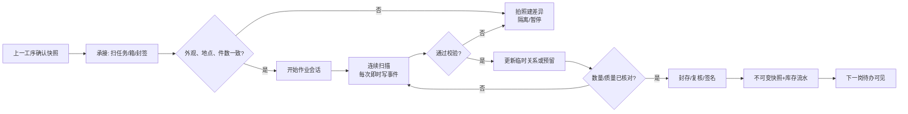

# 手机流转岗位 SOP、交接与权限设计

## 1. 设计基线

本设计把“人、物、任务、记录”放在一起设计。系统页面不是让员工填写复杂单据，而是让员工按物理作业顺序完成扫码；每次作业都必须能回答四个问题：

1. 前一工序交给我什么，数量和封签是什么；
2. 我现在手里实际拿到什么，逐件做了什么；
3. 哪些已通过、哪些异常、哪些还没有核对；
4. 我把什么、以什么数量、交给了谁，下一工序何时可以接手。

### 1.1 不可省略的原则

- **实物优先、扫码留痕**：系统的“预期清单”来自上一工序的不可变快照，系统的“实收清单”来自本工序实际扫描；不能点击“全部收到”代替逐件核对。
- **交接不是自动完成**：发出方确认发出，承运人/接收方确认接收，两个动作分别记录人员、时间、地点和数量。
- **容器可重组，历史不可覆盖**：箱、托盘是可复用的物理容器；拆箱、拆托、重新装载都写事件并结束旧关系，不能修改历史快照。
- **容器只是操作入口**：按箱/托盘扫描后展开为 IMEI 明细；库存、质量和差异最终都落实到每台手机。
- **异常永不丢失**：缺失、多出、错货、IMEI 不符、重复、破损、封签异常都进入异常区和异常单；异常手机与可售手机物理隔离。
- **状态分维度**：建议将物流/保管状态、质量状态、地点、容器关系分开存储，避免一个枚举表达所有组合而造成错误跳转。
- **确认即审计**：确认动作使用事务和幂等键；已确认记录只能撤销/更正，不能删除或直接改库存字段。

### 1.2 现场区域和颜色

每个地点都设固定区域，并在页面和实物使用同样的颜色/名称：

| 区域 | 用途 | 建议颜色 |
|---|---|---|
| 待接收区 | 尚未完成接收的箱/托盘 | 黄色 |
| 待验收区 | 尚未逐台检验的手机 | 黄色 |
| 可用库存区 | 已验收、可发运/销售 | 蓝色 |
| 待装盘/待装箱区 | 已通过但尚未完成包装 | 蓝色带白标 |
| 在途/交接区 | 已发出、等待接收 | 紫色 |
| 异常隔离区 | 缺失、错货、破损、未知 IMEI | 红色 |
| 维修区 | 待维修、维修中、维修完成待验收 | 橙色 |
| 空容器区 | 空托盘、空箱、待清洁容器 | 灰色 |

### 1.3 所有作业的共同三段式

**承接**：员工从“我的待办”打开上一工序生成的任务，扫描任务/发运单二维码，核对目的地、外层件数、封签和外观；不符时先拍照并建立异常，不直接开封或入库。

**作业**：依物理顺序扫码。收货按“单据 → 箱 → 托盘 → IMEI”，包装按“目标箱/托盘 → 内容物”，发运可以混合单位但服务端自动去重。成功扫码只给短促声音、震动和绿色行；错误进入异常列表而不阻断下一次扫描。

**移交**：系统显示预期/实扫/通过/异常/未核对五类数量；操作员整理实物、贴标签、封签、拍照，提交并由规定的另一角色签收。下一工序的待办在签收后才出现“可开始”。

## 2. 岗位和权限总表

> 当前实现采用三个合并岗位边界：深圳综合作业员（收购验收 + 装托盘 + 装箱）、深圳发运员（独立）、加纳管理处综合作业员（到货验收 + 仓库拣货/调拨 + 退回分诊 + 维修建单 + 维修 QA）。维修技师仍独立负责接单和填写维修结果；旧拆分账号只保留为停用历史记录。

| 岗位 | 承接的实物/任务 | 主要作业 | 移交结果 | 页面与权限边界 |
|---|---|---|---|---|
| 深圳综合作业员 | 供应商送货、采购单、空托盘和空箱 | 同一岗位连续完成逐台验收、先扫托盘装载、再扫箱封装 | 已验收手机、已装托盘、已封箱及箱内快照 | 可建采购收货、装/拆托盘和装/拆箱；不能跨到加纳收货或国际发运 |
| 深圳发运员 | 已封装物料、发运申请 | 复核装载，登记承运商/物流号，确认发出 | 在途发运单、交接码、装运清单 | 仅有跨境发运权限；发运后取消需主管审批 |
| 加纳综合作业员 | 承运人、在途箱/托盘、管理处库存、退回物料和维修队列 | 同一岗位承接到货拆箱/逐台验收、仓库拣货调拨、退回接收分诊、维修建单和维修 QA | 通过库存、门店在途调拨、维修队列、QA 处置结果 | 接收/调拨/退回限管理处；维修建单/QA限维修区；不能替代维修技师接单/填维修结果，也不拥有国际发运权限 |
| 门店收货员 | 门店调拨在途货物 | 验封、开箱、开托、逐台清点和快速验收 | 门店可售库存、门店异常单 | 只能操作本店任务和地点；不能查看/改其他门店库存 |
| 门店主管/调拨员 | 本店库存、串货需求 | 审批需求，按单位选货、打包、发出 | 店间调拨在途单 | 可审批本店调拨和差异；不能批准自己的重大异常 |
| 门店退回员 | 待维修/破损手机 | 选择原因、拍照、专用托盘装载、装箱、退回 | 维修退回在途单 | 可建退回和装运；不能将可售手机混入维修退回 |
| 主管/审计 | 各岗位提交的任务和差异 | 审批部分完成、异常处置、库存纠正、追溯 | 关闭异常或生成纠正单 | 主管可审批但不能抹除流水；审计默认只读 |

功能权限与数据范围必须同时判断：例如 `receiving.inspect` 只有在用户拥有加纳接收区范围且接收单处于 `CHECKING` 时才显示；目的地下拉框只返回授权地点，不能让员工借选择地点扩大库存查看范围。

## 3. 七类流程的岗位 SOP

### 3.1 深圳：收购、验收、装盘、装箱、发运

#### A. 采购收货与验收（深圳综合作业员）

**承接**：采购员准备采购单/供应商送货单，验收员在深圳接收区打开“采购收货”任务，扫描采购单二维码。无采购单的临时收货必须选择“无单收货”并要求主管授权。核对供应商、预计台数、送货批次和外箱件数。

**作业顺序**：

1. 在页面点击“开始收货”，确认地点自动为深圳接收区；清点外箱但不把外箱数量当成手机数量。
2. 逐台扫描 IMEI1（必要时录入 IMEI2），系统校验长度、校验位、全局唯一和是否已存在。
3. 对每台执行简化检查：开机、网络/账户锁、外观、屏幕、摄像头、电池、附件；普通合格项可一键“通过”，异常才要求详细原因和照片。
4. 将实物放入与页面同色的“通过”“隔离”“待复核”物理格；系统立即显示最近扫描、预期、实扫、通过、异常、未扫。
5. 结束时点击“提交验收”，选择供应商差异处理（补发、退回、暂存）；不允许删除未匹配 IMEI。

**移交**：系统生成采购收货单、每台验收记录和“待装盘任务”。验收员把通过手机放到待装盘区，隔离手机贴红色异常标签交主管；装盘员通过任务二维码承接。

**异常**：重复 IMEI、无效码、供应商清单中不存在、已售/已在途、成色与采购约定不符均只进入异常，不得通过手工改状态绕过。

#### B. 装入托盘（同一深圳综合作业员连续作业）

**承接**：扫描“待装盘任务”，页面只列出已验收通过且在深圳待装盘区的手机；领取空托盘并确认托盘标签、位置和是否已封存。

**作业顺序**：

1. 点击“开始装盘”，先扫描托盘编码；系统显示托盘当前地点、已有数量、允许的最大建议数量和目标作业批次。
2. 托盘输入框自动切换为 IMEI 扫描框；连续扫描手机，每次成功后立即把手机放入托盘，再扫下一台。
3. 若手机已在其他托盘、地点不一致、未通过验收或被另一会话预留，页面给出具体原因并加入异常，不打断扫描。
4. 点击“结束装盘”后核对数量，打印/粘贴托盘标签（托盘码、数量、批次、质量分组、二维码）；需要封存时记录封签号和照片。

**移交**：托盘放入待装箱区，生成托盘清单和下一步“装箱任务”。装盘员的确认人可以是装箱员或主管；同一人不能在强制双人复核规则下同时确认。

**注意**：托盘容量是配置提示，不以固定槽位推算库存；若现场拆出部分手机，必须产生“拆托/移托”事件，旧托盘剩余清单随时可追溯。

#### C. 装箱封装（同一深圳综合作业员连续作业）

**承接**：装箱员领取待装箱托盘和空箱，扫描装箱任务；页面显示目标路线/批次，防止把不同目的地物料混装。

**作业顺序**：

1. 先扫描箱编码，确认箱在深圳、为空或本次可复用，检查箱体和封签。
2. 连续扫描托盘编码；系统展开每个托盘的手机数，并自动阻止重复扫描内外层导致的重复计数。
3. 每扫一个托盘就实际放入箱中；页面按“箱/托/台”三层显示实时数量。
4. 点击“封箱”，录入封签号、箱体照片、装箱人；打印箱清单贴在箱外。封箱后箱内关系锁定。

**移交**：箱子进入深圳发运待装区，装箱清单和封签号成为发运员的承接凭证。空托盘按空容器流程归还。

**异常**：托盘不在本地点、已封存、含隔离手机、与路线不符、封签号已被使用时停止该件并建异常；不允许只改箱内数量掩盖差异。

#### D. 发运（深圳发运员，独立交接）

**承接**：发运员扫描发运申请/路线码，核对待发箱、托盘或散件的封签、目的地和承运商。发运申请只能包含已通过并已在深圳库存的手机。

**作业顺序**：

1. 选择发运单位模式：整箱、整托、单台；允许混合，但扫描箱后再扫箱内托盘/手机自动去重。
2. 扫描实物装载；系统预留 IMEI，防止另一发运会话同时取走。若只发箱内部分托盘，必须先开箱并按托盘/IMEI精确选择。
3. 对照“箱/托/台”预期和实扫，录入物流单号、承运商、车次/航班和预计到达时间。
4. 主管点击“确认发出”；系统在一个事务中写每台 IMEI 在途流水、关闭发出方当前容器关系（如实物已拆分），并生成交接二维码。

**移交**：实物、纸/电子装运清单、封签照片和交接二维码交给承运人；承运人扫码或人工签名记录 custody。深圳库存不再显示为可拣货。

### 3.2 加纳管理处：到货、拆箱拆托、逐台验收、重装

#### A. 到货承接（加纳综合作业员）

1. 从“待到货”队列打开任务，扫描发运单二维码，系统核对目的管理处、物流号和预计箱/托/台数。
2. 与司机共同清点外箱；逐箱扫描箱码和封签，记录封签完整/破损、箱体破损、少箱/多箱，并在开封前拍照。
3. 点击“登记到货”，把箱放入待接收区；该动作只改变货物保管状态为 `ARRIVED_UNOPENED`，不把手机变成可用库存。

#### B. 开箱、开托与逐台验收

1. 扫描箱码，点击“记录开箱”，录入开箱人、时间、封签实际值和照片；系统列出预期托盘但不自动认定已收到。
2. 取出托盘逐个扫描；缺失托盘进入差异，多出的未知托盘隔离。对每个托盘点击“开始核对”，托盘状态变为 `OPENED`。
3. 从托盘取出手机，逐台扫描 IMEI；系统显示预期资料和深圳验收资料，验收员完成加纳到货检查（IMEI、开机、运输损伤、锁机等）。
4. 每台选择“通过/运输损坏/IMEI不符/未知/缺件/待复核”，并把手机放入对应物理区域。扫描到的多余 IMEI不能直接纳入本单。
5. 页面提供“未核对清单”“异常清单”“重新扫描”快捷按钮；离开时可暂停，不能把未扫项目当成通过。

#### C. 重装和移交

1. 对通过手机点击“重装”，先扫描目标托盘，再连续扫描已通过 IMEI；按质量/批次规则分托，避免把隔离机和可售机混放。
2. 需要装箱时扫描目标箱，再扫描托盘；记录封签号和照片。没有合适容器时可选择管理处货架/散件区，不强迫虚构托盘。
3. 接收员提交预期、实收、通过、异常、未核对数量；主管审核差异。允许 `PARTIAL` 关闭，但必须有异常单、责任人和后续期限。

**移交**：通过手机、重装后的托盘/箱进入管理处可用库存或待上架区；异常手机进入红色隔离区，异常清单交主管/采购/承运商；仓库员从“待上架/待发运”队列承接。

### 3.3 加纳管理处向门店发运（整箱、整托、单台混合）

**承接**：加纳综合作业员打开门店需求/调拨申请，确认目标门店、截止时间、允许的商品/质量范围。拣货前系统锁定来源地点和库存。

**作业顺序**：

1. 选择“整箱”“整托”“单台”入口；扫描箱自动展开其托盘和 IMEI，扫描托盘自动展开其手机；页面明确显示已包含项，防止双计。
2. 整箱发运时保留箱—托盘关系；整托脱离箱发运时先记录拆箱，再让箱保留其余托盘；单台脱离托盘时记录拆托并保留剩余关系。
3. 逐件把实物放入目标发运区；页面显示 `已预留/已拣/待复核`，不允许拣走隔离、维修、已售或另一调拨已预留手机。
4. 按实际装运单位封装，记录新箱/托盘、封签、照片、物流号；主管确认发出。

**移交**：生成门店可扫码的调拨/发运凭证，交承运人或门店司机；手机进入 `IN_TRANSIT`，门店收货任务在目的地可见。

**异常**：库存不足、容器内容变化、扫码重复、路线错误均回到拣货异常；不能用“减少数量”修改已确认需求而不留痕。

### 3.4 门店接收、开箱开托、逐台清点验收

**承接**：门店收货员从待收队列扫描调拨单和司机交接码，核对门店名称、箱数、封签和外观。封签破损先拍照并要求主管见证，再开箱。

**作业顺序**：

1. 扫箱并点击“开箱”，登记封签实际值；取出托盘逐个扫描并点击“开托”。
2. 扫描实际每台 IMEI，页面以“应收清单”为底，实时标记匹配、缺失、多出、错货、损坏；对异常拍照/备注并放入门店红色隔离格。
3. 通过的手机选择货架/库位并放入可售区；不要求员工先理解库存状态，页面只显示“放入可售区/放入隔离区”。
4. 点击“完成收货”时必须选择：全部匹配、部分接收（需原因和主管）、拒收/退回。未核对项目不能自动变成已收。

**移交**：系统把通过手机转为门店库存，销售页面只显示这些手机；差异单交门店主管和管理处处理，未决手机不进入销售可选清单。

### 3.5 门店之间串货（单台、多台、托盘、箱）

**承接**：发出店主管确认调拨原因、目标店和单位；接收店在创建时即被指定为唯一目的地。跨店调拨不允许用销售单或手工改门店字段替代。

**作业顺序**：

1. 发出店选择整箱/整托/单台并扫描；系统自动展开并去重，部分容器要求精确扫描实际手机。
2. 系统建立预留，显示源店库位；拣货员按列表取货、复核 IMEI 后打包。主管审核金额/数量/异常。
3. 发出店确认发出，记录发出人、交运人、时间、封签和物流号，手机进入调拨中。
4. 接收店按 3.4 的外到内顺序收货；实收可少于预期，但必须建立缺失/多出/错货差异，接收店不能替发出店补录。
5. 差异解决前，已实收通过的手机可进入目标店库存；未收到的手机继续保持在途/异常，不能回写为目标店库存。

**移交**：发出店→承运人→接收店各有独立签名/扫码事件；调拨单在全部匹配时完成，部分匹配时为部分完成并显示责任人和时限。

### 3.6 门店维修/破损手机退回管理处

**承接**：门店店员从“待处理问题机”队列选择来源（销售退回、收货破损、日常发现），先由主管确认退回原因和优先级。系统只允许选择本店且当前未售/已退回的 IMEI。

**作业顺序**：

1. 逐台扫描手机，选择标准原因（不开机、屏幕、触控、电池、进水、锁机、外观、缺件等），补充故障描述和照片；不要把一个总数当成多台手机。
2. 先扫描专用维修托盘，再连续扫描 IMEI；维修托盘使用橙/红标签，原则上不与可售机混放。不同故障可同箱但每台必须有原因，若维修供应商要求分组则按原因分托。
3. 扫描目标箱，扫描托盘加入箱；核对箱/托/台数量、故障原因分布、封签和照片。
4. 点击“确认退回发运”，系统把手机置为维修退回在途/破损隔离，门店销售库存立即扣除；未确认的草稿不改变库存。

**移交**：维修退回单、故障明细、照片、封签和交接码交给承运人/管理处；加纳综合作业员按退回单承接。异常 IMEI、可售机混入、箱封破损必须单独建异常。

### 3.7 加纳管理处接收退回、逐台验收入库和分流

**承接**：加纳综合作业员扫描退回单/物流号，核对来源门店、退回原因分布、箱数和封签；破损封签先拍照，登记承运人交接。

**作业顺序**：

1. 扫箱并记录开箱，扫描托盘并记录开托；系统建立按 IMEI 的待验队列。
2. 逐台扫描实际 IMEI，查看门店故障描述和历史销售/维修时间线；执行到货复检并拍必要照片。
3. 对每台选择分流结果：`待维修`、`维修中转区`、`可再次销售待上架`、`报废待批准`、`冻结待复核`。扫描本身不等于入库通过。
4. 先扫描与分流结果对应的目标托盘，再把通过/待维修手机逐台装入；报废和未知机不得装入可用托盘。需要装箱时再扫描目标箱并封签。
5. 提交预期/实收/各分流数量，主管审核报废和部分接收；缺失、多出、IMEI 不符形成责任到人的异常单。

**移交**：维修机交维修技师队列；可再次销售机交管理处可用库存；报废待批准机交隔离区。维修技师只能接收维修状态并填写结果，维修完成后由同一加纳综合作业岗位执行独立于技师的 QA 决定是否恢复可售。

## 4. 状态机

### 4.1 手机的正交状态

建议不要继续把所有组合塞进单一 `PhoneStatus`。至少拆成以下四个维度：

```text
质量：未验收 → 通过 / 隔离 / 待维修 → 维修中 → 维修完成待验收
                    └→ 报废待批准 → 已报废
保管/物流：待入库 → 在地点库存 → 已预留 → 在途 → 到货待验收 → 地点库存
销售：可售 → 销售待确认 → 已售 → 退回待检测
容器：散件 ↔ 托盘 ↔ 箱（由带开始/结束时间的关系事件表达）
```

任何跳转都由业务单据触发；例如“在途 + 质量通过”可以到货待验收，但不能直接跳到门店可售库存。

### 4.2 容器状态

```text
空闲 → 装载中 → 已封存 → 已发出/在途 → 到货未开封
  ↑                         ↓
  └────── 已打开/卸载中 ←────┘
```

箱/托盘被拆分时只结束当前关系并新增关系事件；容器代码原则上全球唯一，若实体重贴标签必须创建新的容器实例/复用周期，不能覆盖旧清单。

### 4.3 单据、作业会话和交接

```text
单据：草稿 → 扫描中 → 待复核 → 已提交 → 已审核 → 已发出 → 接收中
                                      └→ 已完成 / 部分差异 / 已取消
会话：OPEN ↔ PAUSED → READY_TO_CONFIRM → CONFIRMED
                                  └→ CANCELLED
交接：待发出 → 已封签 → 已交承运人 → 到货未开封 → 已开封核对
                                             └→ 完成 / 部分完成 / 异常
```

`部分差异` 只有在差异单、处置人、原因和后续期限齐全时才允许关闭；已确认单据不能物理删除。

## 5. 记录和数据组成

每个岗位的成果至少由以下记录组成，不能只保留一个总数量：

- **业务单据**：采购收货、发运、调拨、接收、退回、维修；包含来源/目的地、责任人、状态和单号。
- **预期快照**：发出或上一工序确认时的箱、托、IMEI清单及来源容器，之后容器重组不改变快照。
- **作业会话与扫描事件**：会话类型、步骤、原始码、规范化 IMEI、扫描顺序、时间、设备、结果码、错误原因、幂等键和离线同步状态。
- **质量/验收记录**：检查阶段、清单版本、每项结果、备注、照片、验收人和复核人。
- **容器关系事件**：手机入托/出托、托盘入箱/出箱、开始/结束时间、来源单据、操作人。
- **封签与交接记录**：封签号、开封/封箱照片、发出人、承运人、接收人、交接时间、预期/实收数量。
- **差异单**：缺失、多出、错货、IMEI不符、破损、重复、封签异常；责任人、严重级别、时限、处置和审批。
- **库存流水**：每台 IMEI 的状态、质量、地点、来源容器、目标容器、单据、操作人和时间；只增不改。
- **预留/锁定**：拣货和发运期间锁定 IMEI/容器，避免并发会话重复出库。

关键数量统一显示：`预期箱/托/台 | 实扫箱/托/台 | 通过 | 异常 | 未核对`。报表以 IMEI 流水为准，不以箱数或托盘数推算。

## 6. 页面、按钮和人因设计

### 6.1 手机端

- 首页只显示当前角色可做的待办，置顶“继续上次作业”；顶部固定当前地点、网络和待同步数。
- 作业页只保留一个主动作：`扫描下一件`；成功不弹窗，错误显示原因并进入异常抽屉；扫码枪输入框始终自动聚焦，相机是备用入口。
- 页面始终显示“下一步：先扫箱码/先扫托盘码/现在扫 IMEI”，员工不需理解数据库状态。
- 关键确认按钮带数量和方向，如 `确认发出（1箱/3托/120台）`、`完成接收（实收118台，异常2台）`；没有无条件的“全部完成”。
- 暂停会话会保存草稿和本地离线队列；服务器确认前明确显示“待同步”，不显示为最终库存。
- 异常采用红色物理格+页面异常卡片，支持补扫、标记原因、拍照、转交主管；普通扫描不被异常弹窗阻断。

### 6.2 PC 端

- 左侧为按地点/角色分组的待办，中间为同一会话工作区，右侧固定数量、差异和交接摘要。
- 支持扫码枪、批量粘贴和 CSV 导入，但每一行仍走同一套服务端校验；不允许直接编辑库存表格。
- 主管可在差异队列按类型/严重级别/期限处理，查看时间线和照片；审计只能只读。
- 支持打印托盘/箱标签、封签清单和交接单；打印内容带二维码和校验摘要，不把完整 IMEI 暴露在不必要的外部单据上。

### 6.3 权限和防错

- 角色权限、地点/组织数据范围、单据状态三层同时校验；界面隐藏不可用按钮，后端仍必须重复校验。
- 制单人与审核人分离：发运确认、重大差异、报废、库存纠正、维修结果验收至少两人；紧急覆盖要求主管权限、原因和二次认证。
- 物理容器/IMEI在会话期间加锁；另一员工扫描时显示“被某作业占用”，可由主管转移会话但不能静默抢占。
- 手机端与 PC 端使用同一状态机和 API，只有布局和输入方式不同；任何一端完成的会话都能在另一端继续。

## 7. 建议的验收指标

- 各交接点的箱/托/台数量匹配率、IMEI 扫描准确率、差异关闭时长。
- 从到货到验收、验收到上架、拣货到发出、发出到签收的停留时间。
- 未封存容器、异常未隔离、在途超期、重复扫描和手工覆盖尝试次数。
- 每台手机可在时间线中看到采购验收、每次容器变化、每次交接、门店收货、销售/退回/维修及最终处置。

## 8. 本版必须统一的记录时点与业务边界

前面的岗位 SOP 说明了“人应该怎么做”，本节把它落实为开发时不可含糊的事务规则。尤其要解决一个现场最关心的问题：**手机扫入托盘后，员工不应该等整批结束才知道系统是否记住了**。

### 8.1 扫描成功不等于所有业务都完成

每一次扫描都分成三个层次，页面要把三个层次用不同标签显示：

| 层次 | 发生时点 | 必须写入的内容 | 对库存/容器的影响 |
|---|---|---|---|
| 扫描事实 | 每次请求成功到达服务端时 | 原始码、规范化码、设备、操作者、时间、顺序、结果、幂等键 | 永久保留；重复/失败也保留事件 |
| 作业事实 | 扫描通过业务校验时 | 会话明细、预期行与实扫行的匹配、当前步骤 | 取决于作业类型，见下表 |
| 业务确认 | 封存、发出、收货或主管审核时 | 快照、签名、封签、差异处置、库存流水 | 只允许符合状态机的最终状态变化 |

不同作业的“即时落库”约定如下：

| 作业 | 每次通过扫描立即做什么 | 点击完成/确认后才做什么 |
|---|---|---|
| 手机 → 托盘 | 写 `scan_event`、会话明细、临时成员关系；更新手机当前托盘并加会话锁，页面显示“已记录/待封存” | 核数、封存、打印标签、生成下一工序任务；取消时写反向拆托事件，不删除原事件 |
| 托盘 → 箱 | 写扫描事实和托盘入箱临时关系，实时显示箱/托/台数量 | 封箱、封签、照片和不可变装箱快照 |
| 拣货（箱/托/单台） | 写拣货明细并建立 IMEI/容器预留；不改变目的地库存归属 | 复核、封装、发出交接，并将预留转为在途 |
| 到货登记 | 写承运交接和 `ARRIVED_UNOPENED` | 开箱、开托、逐台验收和差异处理；未验收手机不能显示为可售 |
| 收货逐台扫描 | 写扫描事实、待验结果和接收暂存区位置；只有明确完成检查项后才写 `PASS/异常` | 完成接收、将通过项转入目标可用区，关闭或转交差异 |
| 维修/退回分诊 | 写每台故障与分流意向，异常机立即隔离 | 主管批准报废/纠正，或维修 QA 通过后恢复可售 |

这样既满足“扫到即形成对应记录”，又不会把“扫过”误当成“已经封存、已经发出或已经验收通过”。

### 8.2 端到端控制流



### 8.3 不允许的快捷方式

- 不允许用“箱数 × 默认装载量”推算手机数量；箱、托、台数量必须各自从明细计算。
- 不允许用一个“全部接收”按钮把未扫项目自动标记为已收；必须选择“全部匹配、部分接收、拒收/退回”之一，并对未核对项建差异。
- 不允许把容器代码当成 IMEI 发送给接收接口；容器扫描必须先展开成不可变的明细快照。
- 发出后不能直接编辑当前地点或容器关系；只能走接收、退回或更正单，保留原始责任人和时间线。
- 任何异常手机不能进入可售区；“待复核”不是可售状态，也不能被销售、拣货或再次包装任务选中。

## 9. 岗位—页面—按钮—记录矩阵

下面的矩阵是培训、原型评审和权限测试的共同基准。按钮名称是面向一线员工的中文，不直接暴露数据库状态名。

| 岗位 | 承接凭证与现场物料 | 页面看到什么 | 主要按钮及顺序 | 形成的记录 | 移交给谁 | 明确禁止 |
|---|---|---|---|---|---|---|
| 深圳综合作业员 | 采购单/供应商送货单、外箱、散机、空托盘/空箱 | 同一作业会话连续完成验收、装托、装箱 | `开始收货` → `扫描 IMEI` → `先扫托盘并连续装载` → `先扫箱并装托盘` → `封存/提交` | 收货单、逐台验收、容器关系、箱/托快照、封签 | 深圳发运员 | 不得跳过 IMEI；不得把异常机装入可用托盘/箱；不得跨地点操作 |
| 深圳发运员 | 发运申请、封装箱/托/散件、承运人 | 预期/已拣/待复核、封签、物流号 | `创建发运` → `扫描装载单位` → `锁定/复核` → `录物流信息` → `确认发出` | 预留、装载清单、发运快照、交接签名、在途流水 | 承运人/加纳综合作业员 | 不得发未封存物料；发出后不得删除或改目的地 |
| 加纳综合作业员 | 在途发运、退回物料、管理处库存和维修队列 | 同一岗位完成到货登记/开箱开托/逐台验收、重装、门店拣货调拨、退回分诊和维修 QA | `登记到货` → `验封/开箱/开托` → `逐台验收` → `拣货/调拨` → `退回分诊` → `维修 QA` | 到货交接、逐台验收、差异、容器快照、调拨/维修/处置流水 | 门店收货员/维修技师 | 管理处收发权限限 GH-MGMT；维修建单/QA 限 GH-REPAIR；不得代替维修技师接单/填维修结果；不得国际发运 |
| 门店收货员 | 调拨单、司机、箱/托、封签 | 本店应收清单、匹配/缺失/多出/损坏 | `登记到货` → `开箱` → `开托` → `逐台清点` → `放入可售/隔离区` → `完成收货` | 实收明细、验收、差异单、门店库位流水、签收 | 门店主管/销售可用库存 | 不得代发出店补录缺失；不得将未核对机放入销售 |
| 门店主管/调拨员 | 串货需求、本店库存、目标店 | 需求审批、可选整箱/整托/单台、差异责任 | `审批调拨` → `选择发运单位` → `复核` → `确认发出` → `处理差异` | 调拨单、预留、交接、审批和差异处置 | 目标店主管/收货员 | 不得批准自己的重大差异/报废；不得用销售单替代调拨 |
| 门店退回员 | 待维修/破损机、维修托盘/箱 | 每台故障原因、销售/收货历史、隔离提示 | `新建退回` → `扫 IMEI` → `选故障/拍照` → `装维修托盘` → `封箱` → `确认退回发出` | 退回单、原因、照片、维修容器快照、在途交接 | 加纳综合作业员 | 不得混入可售机；不得只填总数不填 IMEI |
| 加纳综合作业员（拣货/调拨发出/退回分诊） | 门店需求、可用库存、退回发运、封签和故障单 | 按箱/托/IMEI 拣货、封装调拨、接收退回并逐台分流 | `开始拣货` → `扫箱/托/IMEI` → `确认调拨发出`；或 `登记退回` → `开箱/开托` → `逐台复检` → `分流` | 预留、调拨清单、退回实收、分诊、差异和容器关系 | 门店收货员/维修技师 | 管理处收发仅限授权地点；不得把“收到”直接变成“维修完成”或“可售” |
| 维修技师 + 加纳综合作业员 QA | 维修队列、故障明细、手机 | 技师记录故障/配件/维修步骤；加纳综合作业员复核结果 | 技师 `接收维修` → `开始维修` → `完成维修`；综合岗位 `QA 通过/冻结/报损` | 维修工单、用料、照片、质量状态、独立 QA 结果 | 管理处可用库存/隔离区 | 技师不得批准自己的最终可售/报废；综合岗位不能代替技师填写维修结果 |
| 采购建单/财务审核 | 供应商报价、采购合同、收货差异 | 供应商、价格、币种、审批额度和付款状态 | `建采购批次` → `提交价格审核` → `批准/退回` | 采购单、价格版本、审批意见；不接触逐台收货权限 | 深圳采购/财务 | 不得以价格审核代替实物验收 |
| 仓库上架员 | 已验收通过手机、目标货架/托盘 | 待上架清单、质量和区域约束 | `领取上架任务` → `扫目标容器/库位` → `扫 IMEI` → `完成上架` | 上架会话、目标区域、关系事件、交接记录 | 拣货员/销售库存 | 不得上架异常、维修或未收货手机 |
| 承运人/司机（临时身份） | 交接二维码、封签箱/托盘 | 仅本运输单的方向、件数、封签 | `查看交接摘要` → `确认接收实物` 或 `拒绝/异常` | 临时身份、签名/照片、时间、设备、交接结果 | 目的地接收员 | 不得查询库存、修改 IMEI 或关闭差异 |
| 主管/审计 | 待复核任务、差异、时间线 | 全链路快照、责任人、照片、权限范围 | `批准部分接收`、`处理差异`、`批准报废`、`生成更正单`、`只读追溯` | 审批、处置、纠正流水；审计只读 | 相关岗位/财务 | 不得物理删除流水；密码等秘密不得写入审计 |

## 10. 权限模型：动作、范围、状态三重门槛

### 10.1 权限命名建议

权限不再按“能不能看某个菜单”设计，而按最小动作拆分。后端和前端共用同一组稳定代码：

```text
inventory.view / inventory.reserve / inventory.adjust
work_session.create / scan / pause / resume / cancel / confirm
container.pack / unpack / seal / open / move
shipment.create / pick / verify / dispatch / handoff
receiving.arrive / open / inspect / accept_partial / reject
transfer.create / approve / pick / dispatch / receive
return.create / pack / dispatch / receive / triage
repair.create / accept / work / qa / approve_disposal
discrepancy.create / assign / resolve / approve / close
report.view / report.export / audit.view
user.manage / role.manage / scope.manage
```

`TRAY_MANAGE`、`BOX_MANAGE` 这类过粗权限可以保留为兼容别名，但新页面不得只判断它们；例如“能建托盘”不自动等于“能封存托盘”或“能拆正在途托盘”。

### 10.2 角色 × 动作矩阵

符号含义：`●` 可执行，`○` 只读，`△` 需主管/双人审批，`—` 禁止。

| 角色 | 建会话/扫描 | 装卸/封存 | 拣货/预留 | 发出/签收 | 逐台验收 | 差异处置 | 库存纠正/报废 |
|---|---:|---:|---:|---:|---:|---:|---:|
| 深圳综合作业员 | ● | ● | — | — | ● | ●（建） | — |
| 深圳发运复核 | ● | ○ | ● | ●（发出） | ○ | ●（建） | △ |
| 加纳综合作业员 | ● | ●（开封/重装） | ● | ●（签收/调拨发出） | ● | ●（建/QA） | △（报废/纠正） |
| 门店收货 | ● | ●（开封） | — | ●（签收） | ● | ●（建） | — |
| 门店主管 | ● | ● | ● | ● | ○ | △（处理） | △ |
| 退回/维修人员 | ● | ●（维修容器） | — | ●（退回） | ●（复检） | ●（建） | — |
| 采购/财务 | ○/●（建单） | — | — | — | ○ | ●（供应商差异） | △（价格） |
| 仓库上架员 | ● | ●（上架） | — | — | ○ | ●（建） | — |
| 承运人/司机临时身份 | — | ○（验封） | — | ●（仅交接） | — | ●（拒绝/异常） | — |
| 主管/库存管理员 | ● | ● | ● | △（复核） | △ | △（关闭） | ●/△ |
| 审计 | ○ | ○ | ○ | ○ | ○ | ○ | ○ |

### 10.3 数据范围和字段范围

每次授权必须同时解析资源的 `country_id → organization_id → location_id → zone_id`，再与用户的范围比较。`COUNTRY`、`ORGANIZATION`、`LOCATION`、`ZONE`、`OWN`、`ALL` 的组合约束如下：

- `ALL` 不允许填写范围值；其他范围必须填写对应的有效 ID，管理员保存时校验组合合法性。
- `OWN` 必须把资源的 `created_by` 或当前分配责任人传入授权判断，不能只传 `location_id`。
- 多阶段单据按**当前步骤**计算地点，不把来源地点和目的地点的权限并集直接展示成可操作地点。
- 前端只显示服务端返回的授权地点和库位；后端仍对每一个扫描、查询和确认请求重新校验。
- IMEI 列表默认显示后四位；只有逐台作业、异常处理和审计角色可看完整 IMEI。采购价、客户信息和维修成本使用字段级权限遮罩。

按钮显示条件统一为：

```text
显示/可点击 = 动作权限 ∩ 数据范围 ∩ 单据状态守卫 ∩ 会话占用校验 ∩ 岗位分离规则
```

隐藏按钮只改善体验，不能替代后端拒绝；每个拒绝响应要告诉员工“哪件物料、当前状态、下一步应联系谁”。

## 11. 目标数据模型与不可变记录

### 11.1 对现有模型的增量方向

不推翻现有 FastAPI + SQLAlchemy + Vue 3 架构，采用新增表、兼容投影和分阶段迁移：

| 现有对象 | 目标增量 | 迁移原则 |
|---|---|---|
| `phone_devices` | `quality_status`、`custody_status`、`inventory_state`、`current_box_id`、`current_zone_id`、`version`、IMEI 别名索引 | 先保留旧 `status` 作为兼容读模型；新写入只走领域服务 |
| `trays` / `boxes` | `unit_id`、容器类型/实例、`capacity_hint`、`lifecycle_status`、`seal_status`、`version` | 代码复用时创建新的复用周期，不能覆盖旧快照 |
| `PhoneTrayRelation` / `TrayBoxRelation` | 由 `unit_membership_events` 投影当前关系 | 旧关系表保留查询兼容，所有变更写事件表 |
| 各类 shipment/transfer/return 文档 | 统一 `operation_documents` + `manifest_lines` + 专用扩展字段 | 原单号继续可查，来源/目的地和快照不可变 |
| `InventoryTransaction` | 增加 `event_group_id`、`source_document_id`、`source_session_id`、`from/to_zone`、`device_id`、`reason_code` | 只追加，不允许普通 CRUD 修改历史行 |

### 11.2 建议新增的核心表

| 表 | 关键字段 | 约束/用途 |
|---|---|---|
| `handling_units` | `id`, `unit_type(PHONE/TRAY/BOX)`, `code`, `instance_no`, `status`, `version` | 手机作为 `PHONE` 一等 handling unit，与 `phone_devices.id` 一对一映射；IMEI 别名仍只指向该 phone_id；容器代码按复用周期解析 |
| `unit_membership_events` | `event_group_id`, `sequence_no`, `parent_unit_id`, `child_unit_id`, `action(ADD/REMOVE)`, `from/to_location`, `from/to_custody`, `effective_at`, `session_id`, `document_id`, `operator_id`, `reversal_of` | 表达箱—托—手机的开始/结束关系，可按事件组重放；历史不可覆盖，禁止循环嵌套 |
| `operation_documents` | `kind`, `number`, `source_org/location`, `destination_org/location`, `status`, `created_by` | 统一单据状态和权限入口 |
| `manifest_lines` | `document_id`, `unit_id/phone_id`, `source_path`, `expected_qty`, `actual_qty`, `actual_unit`, `line_state(EXPECTED/MATCHED/EXTRA/MISSING/REJECTED)`, `discrepancy_id`, `snapshot_hash` | 发运/接收预期快照；容器扫描展开后每台手机只出现一次，部分收货责任直接落在行上 |
| `work_sessions` | `document_id`, `operation_kind`, `target_unit_id`, `operator_id`, `device_id`, `status`, `started/paused/ended_at`, `idempotency_namespace` | 支持手机/PC继续、暂停、转交和断线恢复 |
| `work_session_items` | `session_id`, `phone_id/unit_id`, `scan_order`, `result`, `reason_code`, `accepted_at` | 作业明细与预期行匹配；重复扫描不产生第二个业务成员 |
| `scan_events` | 原始码、规范化码、码类型、结果、错误、网络/设备、幂等键、时间 | 所有扫描事实的不可变审计流，含失败和重复 |
| `inspection_records/items` | 阶段、清单版本、每项结果、照片、验收人、复核人 | 采购、到货、门店收货、退回复检复用同一结构 |
| `handoffs` / `seal_records` | 发出人、承运人、接收人、封签实值、照片、签名、件数 | 发出与接收分离；破封自动生成差异 |
| `discrepancy_cases` | 类型、严重级别、涉及 IMEI/容器、责任方、状态、期限、处置、审批 | 缺失/多出/错货/破损/未知码统一处理 |
| `inventory_events` | phone/unit、from/to custody/location/zone、原因、来源事件、操作者 | 以 IMEI 为粒度的只增库存流水 |
| `reservations` | 资源类型/ID、会话、持有人、过期时间、版本、状态 | 拣货和封装并发锁；整箱 reservation 与箱内托/手机互斥，部分拆分先降级为手机级锁；超时只能按规则释放并留事件 |
| `location_zones` | 地点、区域类型、颜色、可容纳状态/质量 | 把“待接收/隔离/维修/可用”落实到物理位置 |
| `attachments` | 对象、文件哈希、拍摄人/设备、类型、存储地址 | 封签、破损、验收、维修证据，权限继承业务单据 |

### 11.3 必须落地的数据库不变量

1. 同一 IMEI（包括 IMEI2 别名）只能有一个有效资产；查询先规范化并映射到 `phone_id`。
2. 同一时刻一台手机最多一个有效父托盘、一个有效父箱；箱内托盘和托盘内手机的地点必须一致。
3. 有效关系写入使用数据库事务、行锁或版本号；冲突返回“已被哪一个会话占用”，不能静默覆盖。
4. 扫描接口使用客户端幂等键；同一会话+同一规范化码的重复请求返回原结果，原始重复事件仍保留。
5. 容器扫描展开时保存 `source_path`（例如 `BOX-01/TRAY-03/IMEI-...`）；部分发运先产生拆分事件，再生成新的路径。
6. 容器代码复用时由服务端根据“当前有效复用周期”解析，旧周期只读；标签显示实例/批次或校验摘要，员工不能从历史下拉框任选同码旧周期。
7. 封存容器不可追加；在途容器不可被普通装卸；开封必须记录实际封签值和照片。
8. 事务失败整体回滚；事件成功但响应丢失时，客户端用幂等键重试，不另造库存流水。
9. 审计事件禁止写入密码、验证码、JWT 或完整支付敏感信息；用户更新日志只记录字段名和脱敏后的差异。

### 11.4 单次扫描的事务语义

```text
接收请求
  → 规范化条码 / 判断 IMEI1、IMEI2、箱码、托盘码
  → SELECT ... FOR UPDATE 或版本校验
  → 检查地点、状态、权限、会话占用、容量、重复
  → 写 scan_event（无论 accepted/duplicate/rejected）
  → accepted 时写 work_session_item 与关系事件/预留
  → 提交事务并返回新的计数、下一步提示和异常原因
```

任何“完成”接口都只能汇总已存在的明细，不能根据请求里的总数量凭空生成手机记录。

## 12. 前端信息架构与现场交互

### 12.1 手机端：角色化“待我处理”

登录后不显示十几个抽象菜单，而显示当前地点、角色和四类队列：

1. **现在要做**：已由上一岗确认、且当前用户有权限承接的任务；按超时和优先级排序。
2. **继续上次作业**：当前用户或经授权转交给他的 `OPEN/PAUSED` 会话。
3. **异常待处理**：红色隔离、封签异常、缺失/多出、被锁定资源。
4. **我已移交**：等待下一岗签收或主管审核的任务。

顶部固定显示 `地点/区域 · 当前任务 · 网络状态 · 待同步数`。地点由用户范围和任务决定，普通员工不能在作业页随意切换到其他门店。

### 12.2 通用扫描页状态

| 屏幕区 | 内容 | 人因目的 |
|---|---|---|
| 顶栏 | “下一步：先扫托盘码/现在扫 IMEI/请扫箱码” | 不让员工理解内部状态机 |
| 中央大字 | 当前目标容器、已完成 `118/120`、剩余容量、当前物理区域颜色 | 一眼知道手上物料放哪里 |
| 最近扫描 | 最近 5 条，显示后四位、机型、结果、时间 | 便于快速发现漏扫/误扫 |
| 底部主按钮 | `暂停`、`撤销上一件`、`换容器`、带数量的 `完成/确认` | 单手可触达、避免误提交 |
| 右侧/抽屉 | 异常、未核对、照片、交接摘要 | 异常不阻断正常连续扫描 |

首次扫描规则必须由页面状态机强制执行：

```text
装盘：未选目标 → 只能扫托盘码 → 已选目标 → 只能扫 IMEI
装箱：未选箱 → 只能扫箱码 → 已选箱 → 只能扫托盘码（部分拆分才允许 IMEI）
收货：未选任务 → 只能扫任务/发运码 → 已登记到货 → 箱 → 托盘 → IMEI
```

扫码枪输入 `Enter` 自动提交；相机扫码是备用入口。成功反馈为短声/震动/绿色 800ms，不弹遮挡式对话框；失败显示明确原因（如“该手机在另一会话中，放入红色隔离格”），自动进入异常抽屉后仍可继续下一次扫描。

### 12.3 PC 端：批量复核而非另一套业务

- 左栏：按地点、优先级、状态的待办；中栏：当前作业会话和逐行扫描；右栏：数量、差异、封签、签名和时间线。
- 支持扫码枪、批量粘贴、CSV 导入和打印标签，但每一行必须调用同一服务端校验，不能直接编辑库存字段。
- 主管视图增加“差异队列”和“会话占用”面板，可转交会话、批准部分接收、查看照片和生成更正单。
- 手机端/PC 端共享 `work_session`；一端暂停后另一端可继续，所有已扫条目和异常顺序一致。

### 12.4 交接回执页

提交后不只弹“成功”，而显示可扫码回执：

```text
单号：GH-SH-20260903-0012
方向：深圳 → 加纳管理处
实物：箱 3 · 托 8 · 手机 120
封签：SEAL-8842
状态：已交承运人，等待目的地登记到货
发出人：***   时间：***
下一步：承运人/接收员扫描本二维码
```

回执可打印，但外部纸面默认只显示 IMEI 后四位和数量；完整明细须在授权页面查看。

### 12.5 断网、换设备和恢复

- 断网时允许继续录入到本地待同步队列，屏幕明确标记“未同步，不是最终库存”；不允许离线确认发出、报废或重大差异。
- 恢复联网后按原顺序以幂等键补传；冲突项进入异常，不覆盖服务器已确认结果。
- 会话暂停保存最后目标容器、最近扫描、未扫清单和物理区域；换手机/PC扫码会恢复同一会话。
- “撤销上一件”只对当前未封存会话开放，并写反向事件；封存/发出后改走纠正单。

## 13. 异常、责任和补救规则

| 现场情况 | 系统即时动作 | 物理动作 | 责任/后续 |
|---|---|---|---|
| 无效 IMEI 或校验失败 | `scan_event=INVALID`，不生成手机 | 放入待复核格，不能入托 | 操作员可重扫；重复发生记培训指标 |
| 同会话重复扫描 | 返回原业务行，另记 `DUPLICATE` | 不重复放入容器 | 页面提示“已记录”，不阻断 |
| 已在别的托盘/会话 | 拒绝关系变更，显示占用会话 | 暂停移动，放隔离格 | 主管转移或释放锁，保留原因 |
| 未验收/维修/已售机混入 | 拒绝装盘/拣货 | 立即放红/橙隔离区 | 责任岗位建差异，禁止销售 |
| 多出/未知 IMEI | 接收扫描事实但不纳入预期行 | 单独隔离并贴异常标签 | 主管、承运人或供应商调查 |
| 缺失/未扫 | 保留 `UNCOUNTED`，不伪造收到 | 实物继续在途/待核区 | 只能部分接收并指定责任人/期限 |
| 箱/托/IMEI 与目的地不符 | 当前行转异常，禁止自动归属 | 不放入可用区 | 发出方与接收方共同处理 |
| 封签破损或不一致 | `SEAL_MISMATCH`，要求照片/见证人 | 先放待接收隔离区 | 主管决定继续开封或拒收 |
| 容量达到配置上限 | 阻止继续扫描并提示换托盘 | 贴满盘标签 | 可由主管授权超装并记录理由 |
| 部分发运/部分拆箱 | 先写拆分事件和新路径 | 重新贴容器标签 | 旧快照不变，下一单使用新明细 |
| 发运前取消 | 释放预留、会话回到草稿/拣货 | 物料回待发区 | 记录取消人和原因 |
| 发运后发现错误 | 禁止直接改库存 | 按退回/纠正流程 | 原交接仍保留，新增纠正单 |
| 离线重复补传 | 以幂等键返回原结果 | 按服务器结果调整 | 冲突进入异常，不静默覆盖 |
| 管理员修改密码 | 审计只记“密码字段已修改” | 无现场动作 | 永不记录明文密码、验证码或令牌 |

## 14. 开源项目借鉴边界

本项目保留 Python FastAPI、SQLAlchemy、MySQL 8 和 Vue 3.5；借鉴的是经过验证的业务边界和交互，不直接把另一套 ERP 运行时塞进当前仓库。以下是开发时应落在设计评审单上的对应关系：

| 项目/资料 | 可借鉴的成熟做法 | 在本项目的落地 | 许可证/注意 |
|---|---|---|---|
| [Odoo Barcode receipts & deliveries](https://www.odoo.com/documentation/18.0/applications/inventory_and_mrp/barcode/operations/receipts_deliveries.html) 与 [Barcode setup](https://www.odoo.com/documentation/18.0/applications/inventory_and_mrp/barcode.html) | 扫描作业、产品/包装/调拨码、现场实时验证和最终校验 | 通用扫描页、箱/托展开、带数量的确认按钮 | Odoo 社区核心通常为 LGPL-3；只借鉴概念和公开文档 |
| [Odoo package](https://www.odoo.com/documentation/19.0/applications/inventory_and_mrp/inventory/product_management/configure/package.html) 与 [serial numbers](https://www.odoo.com/documentation/18.0/applications/inventory_and_mrp/inventory/product_management/product_tracking/serial_numbers.html) | Package 一等容器、序列号粒度、整包移动与部分拆包 | `handling_units`、source path、整箱/整托/单台入口 | 复用代码前必须逐文件核对 LGPL 与版权声明 |
| [OCA Shopfloor](https://github.com/OCA/stock-logistics-shopfloor/tree/18.0/shopfloor#readme)、[reception](https://github.com/OCA/stock-logistics-shopfloor/tree/18.0/shopfloor_reception#readme)、[single product transfer](https://github.com/OCA/stock-logistics-shopfloor/tree/18.0/shopfloor_single_product_transfer#readme) | 按岗位拆分拣货、接收、单品转移，移动优先 REST 作业 | “待我处理”队列、接收/拣货/装箱独立会话 | OCA 各模块许可证需逐项核对；不复制整个 Odoo 依赖链 |
| [OCA transport / shipment advice](https://github.com/OCA/stock-logistics-transport/tree/18.0/shipment_advice#readme) | 装载、卸载、运输单和交接责任分开 | `handoffs`、承运人二维码、发出/到货两个签名 | 重点借鉴状态拆分，避免 dispatch 立即等于 receive |
| [ERPNext Stock Entry](https://docs.frappe.io/erpnext/stock-entry)、[Delivery Note](https://docs.frappe.io/erpnext/delivery-note)、[Serial and Batch Bundle](https://docs.frappe.io/erpnext/serial-and-batch-bundle) | Material Issue/Receipt/Transfer/Repack、在途、序列号数量一致、不可变 ledger | 库存事件账本、重装、序列号与数量双重校验 | ERPNext 为 GPLv3；不直接复制 Frappe/ERPNext 代码 |
| [InvenTree stock](https://docs.inventree.org/en/stable/stock/) 与 [mobile stock views](https://docs.inventree.org/en/stable/app/stock/) | 序列化库存、层级库位、移动端扫码进入库位/转移/盘点 | `location_zones`、手机端上下文扫码、设备/库位记录 | InvenTree 为 MIT；仍需检查具体文件和依赖许可证 |
| [OpenBoxes receiving](https://docs.openboxes.com/en/stable/api-guide/inbound/receiving/) 与 [outbound status](https://docs.openboxes.com/en/latest/api-guide/outbound/stockMovementStatus/) | 预期/实收/剩余数量、staging、EDITING→VERIFYING→PICKING→PICKED→ISSUED | 部分接收、差异责任、拣货状态机、待接收区 | OpenBoxes 为 EPL-1.0；适合借鉴低资源仓储场景的流程边界 |
| [OpenWMS receiving](https://github.com/openwms/org.openwms.wms.receiving#readme) 与 movements | Transport unit、盲收/预期收货、质量检查、位置移动 | 箱/托运输单元、到货未开封、质检与区域 | 公开组件多为 Apache-2.0，但需逐仓库核对 |

共同结论：Odoo/OCA 解决“扫描作业如何拆分”，ERPNext 解决“库存流水不能被覆盖”，InvenTree 解决“序列化库存和移动端上下文”，OpenBoxes/OpenWMS 解决“低资源环境下预期与实收、运输单元和 staging”。本项目将这些优点组合到自己的领域服务中，并保留逐台 IMEI 的审计粒度。

## 15. 现有代码与目标蓝图的差距

以下不是泛泛的“以后优化”，而是开发验收时要逐项关闭的缺口（行号以当前工作区为准）：

| 当前缺口 | 证据位置 | 造成的现场风险 | 目标修复 |
|---|---|---|---|
| 手机只有一个 `status`，没有箱、保管、质量正交维度 | `backend/app/db/models.py:33-49` | “已验收但在途/已隔离但在托盘”等组合无法表达 | 增加正交状态和事件流水 |
| 托盘/箱无容量、封存、开封、在途生命周期和操作历史 | `backend/app/db/models.py:316-357` | 容器可被重复装载或历史被覆盖 | `handling_units`、状态守卫、封签记录 |
| 关系辅助函数只改当前关系，常缺来源单据/操作人/事件 | `backend/app/domain/container_service.py:32-121` | 无法证明谁何时把哪台机放入哪个容器 | 关系事件 + 会话 + 不可变快照 |
| 采购一步直接 `COMPLETED`，没有批次验收和待装盘交接 | `backend/app/domain/purchase_service.py:31-87` | 未验收机可能被后续流程选中 | 收货/验收/隔离分阶段 |
| 发运接口直接改 `IN_TRANSIT`，没有拣货、封装、双签 | `backend/app/domain/shipment_service.py:35-138,141-281` | 少装、错装、未交承运人即显示在途 | 预留→复核→封签→发出交接 |
| 到货 `start_receiving` 倾向一次移除全部手机 | `backend/app/domain/transfer_service.py:128-199` | 未开箱/未逐台验收却改变归属 | 到货未开封→开箱→逐台接收 |
| 接收只接受预期 IMEI，前端容器码可能被当作 IMEI | `backend/app/domain/transfer_service.py:128-199`、`frontend/src/App.vue:452-512` | 整箱/整托收货必然错配，多出无法入异常 | 统一展开 manifest 和差异单 |
| `complete=true` 可配空清单并把缺失冻结 | transfer API/service | 一键完成掩盖未核对和责任 | 强制全部/部分/拒收分支 |
| 退回直接进入 `WAITING_REPAIR`，没有到货验收和分诊 | `backend/app/domain/sales_service.py:150-280` | 退回可售/破损混杂，维修状态失真 | 退回在途→逐台复检→分流 |
| 销售确认清空地点，部分容器按代码重查当前对象 | `sales_service.py:237-280`、`shipment/transfer` 完成逻辑 | 容器复用/拆分后可能移动错误实物，追溯断裂 | 不可变 unit ID + source path + 销售历史 |
| 无 `SELECT FOR UPDATE`/版本锁/会话占用 | 各领域服务 | 两名员工可同时拣同一台手机 | reservation、行锁、冲突提示 |
| 权限范围只传 location 或 organization，COUNTRY/OWN 实际不可用 | `backend/app/core/access.py:8-24` 及各 API | 员工看到错误地点，或合法岗位被误拒 | 统一资源解析和 scope 校验 |
| 多阶段任务前端按权限并集展示地点 | `frontend/src/App.vue:143-147` | 页面让员工尝试当前阶段无权操作 | 服务端按当前步骤返回地点 |
| 前端把一个持久 `localStorage` 幂等键复用于后续不同操作 | `frontend/src/api.ts:15-23,51-53` | 后续正常提交可能被服务端误判为重复并返回 409 | 按会话/动作命名空间生成新键，成功响应与草稿分别保存 |
| 待办文档默认只按来源组织可见 | `backend/app/api/documents.py` | 目的地接收员看不到上一岗已发出的待收任务 | 来源/目的地/当前步骤分别授权，交接后目的地自动出现待办 |
| 用户更新审计可能原样记录 `password` | `backend/app/api/admin.py:327-347` | 明文凭据泄露到审计 JSON | 永久脱敏并补回归测试 |
| 前端是一次性“扫描列表→提交”模态框，无持久会话/封存/交接 | `frontend/src/App.vue:78-89,452-512`、`frontend-pc/src/App.vue:280-411` | 断电、换设备、批量作业和异常复核困难 | 通用 work session + 移动/PC 同步 |
| `get_phone_by_imei` 默认只查 IMEI1 | 后端查询层 | 扫 IMEI2 会被误判为未知/重复 | IMEI1/IMEI2 规范化别名索引 |

## 16. 分阶段实施与每阶段出口

### P0：作业基础和安全底座

- 建 `location_zones`、`handling_units`、容器生命周期和容量提示。
- 建 `work_sessions`、`scan_events`、`reservations`、`unit_membership_events`、`inventory_events`。
- 统一 IMEI1/IMEI2 解析、幂等键、行锁/版本号、权限 scope 解析和密码审计脱敏。
- 完成手机端/PC 端通用扫描组件，不先改所有业务页面。

**出口**：可在测试库完成“扫托盘→扫三台手机→刷新/换设备继续→撤销一台→封存”的全链路，重复请求不重复入账，并能看到完整事件时间线。

### P1：深圳 → 加纳管理处闭环

- 采购收货/逐台验收 → 装托 → 装箱 → 发运/承运交接。
- 加纳到货未开封 → 开箱开托 → 逐台验收 → 重装/上架。
- 实现封签、照片、部分接收、缺失/多出/错货差异和双人签收。

**出口**：真实演练一箱多托、托盘部分拆分、封签破损、少一台、多一台、重复 IMEI 五种异常，任一异常都不进入可售库存且责任明确。

### P2：管理处 → 门店

- 调拨申请、库存预留、按整箱/整托/单台混合拣货。
- 目标门店收货、开箱开托、逐台清点、门店库位和差异责任。
- 供应链待办只在上一岗确认后对下一岗可见。

**出口**：整箱、整托、单台三种发运单位可混用但明细自动去重；门店不能代替管理处补录缺失，部分收货可独立结案。

### P3：店间串货、维修退回和分诊

- 店间调拨复用同一发运/收货/交接会话。
- 退回原因、照片、维修专用容器、加纳综合作业员逐台分诊、维修工单和独立 QA。
- 报废、库存纠正和重大差异双人审批。

**出口**：维修机、可售机、报废待批机在任何页面和物理区域都不混淆；维修完成不能自动变成可售。

### P4：报表、打印和离线增强

- 交接单、箱/托标签、异常超时、在途追踪、IMEI 全生命周期和岗位绩效。
- 断网队列、冲突合并、设备管理、照片压缩和审计导出。

**出口**：以事件流水重建任意一台手机的路径，报表数量与明细一致；离线补传不产生重复库存。

每个阶段都必须先做异常场景验收，再扩展成功路径；不得以“接口返回 200”代替现场演练。

## 17. 开发前需要确认的业务参数（已给出建议默认值）

为了避免把未知现场规则硬编码，以下参数在第一次原型评审时确认。若用户暂未指定，按“建议默认”实现并在配置页可改：

| 参数 | 建议默认 | 影响 |
|---|---|---|
| 托盘容量 | 按托盘类型配置；未知时只警告不硬阻断 | 是否允许超装、剩余槽位提示；不用于推算库存 |
| 是否跟踪槽位 | 不跟踪槽位，只跟踪托盘成员 | 若现场以后需要逐槽定位，再增加 slot 事件，不改变 IMEI 流水 |
| 箱内托盘数量 | 不设固定数量 | 通过清单和容量提示控制，不因数量估算手机 |
| 可售与异常是否混托 | 默认禁止 | 现场确需混装时必须按质量分区/标签并主管授权 |
| 跨地点封签 | 深圳↔加纳、管理处↔门店默认必填 | 同地点短距离移库可配置为可选，但仍记录交接 |
| 部分接收 | 允许 | 必须有差异类型、责任人、期限；未收到不转目标库存 |
| 承运人身份 | 姓名/电话/证件后四位或司机账号至少一项 | 形成可追溯交接；敏感证件字段需遮罩 |
| 双人分离 | 发出、重大差异、报废、库存纠正、维修 QA 默认需要 | 紧急覆盖需主管、原因、二次认证 |
| 物理区域 | 每个地点至少待接收、待验收、可用、隔离、维修、空容器 | 页面颜色与现场标签统一 |
| 销售可选库存 | 仅 `quality=PASS` 且 `custody=LOCATION_STOCK` 且无预留 | 防止未验收/维修/在途手机被销售 |
| 旧 API 兼容期 | 保留旧接口只读/转换层一个版本周期 | 迁移旧客户端时禁止绕过新状态机 |

## 18. “满意结果”的完成定义

当且仅当以下条件同时满足，才可认为这套岗位设计真正落地，而不是换了一套菜单：

1. 一线员工只按屏幕的“下一步”扫描，并能按颜色把实物放入正确区域，不需要理解数据库状态名。
2. 扫描成功即有可追溯记录；刷新、断电、换设备后不会丢失已扫明细；重复扫描不会重复入账。
3. 每个交接都有预期快照、实收明细、封签/照片、发出人与接收人、时间和地点；部分差异有责任人和期限。
4. 箱、托盘可以整件或部分重组，任何拆分都能在 IMEI 时间线中还原，容器复用不覆盖历史。
5. 异常机永不进入可售库存；权限、地点范围、状态和会话锁在前后端一致执行。
6. 手机端和 PC 端是同一作业会话的两种输入方式，而不是两套互不相容的业务逻辑。
7. 测试不仅覆盖成功路径，还覆盖少货、多货、错货、封签破损、重复、并发、离线、撤销和权限越界。

这份文档是后续数据库迁移、API、页面原型、岗位培训和 UAT 的共同基线；如果实现与本文件冲突，应先记录业务例外并更新状态机/权限矩阵，而不是在某个页面增加一个绕过校验的按钮。

## 19. 边界场景补充规则（实现前不得省略）

### 19.1 按实物流转单位分支，而不是强制经过箱子

箱子不是所有路径的必经层级。所有发运、接收和退回页面都必须根据实际 `unit_type` 进入对应分支：

| 实际方式 | 首次扫描 | 后续扫描 | 预期明细 |
|---|---|---|---|
| 整箱 | 任务/发运码 → 箱码 | 箱内托盘/IMEI 仅在开箱或抽查时扫描 | 箱 → 托盘 → IMEI |
| 整托直发（没有箱） | 任务/发运码 → 托盘码 | 逐台 IMEI 或按托盘展开 | 托盘 → IMEI |
| 散台直发 | 任务/发运码 → IMEI | 连续 IMEI | IMEI |
| 箱内部分托盘 | 任务/发运码 → 箱码 | 授权开箱 → 选择/扫描实际托盘 | 新的托盘/IMEI 明细路径，原箱快照不变 |
| 维修退回混合单位 | 退回单 → 箱/托盘/IMEI 任意一种 | 按实际装载继续扫描 | 每台 IMEI 带退回原因 |

扫描箱码后不能默认“整箱已收”；扫描托盘直发也不能等待一个不存在的箱码。服务端返回 `next_expected_unit_types`，前端只允许当前分支的输入类型。

### 19.2 到货未开封的地点和保管语义

`ARRIVED_UNOPENED` 表示实物已经在目的地现场，但仍由承运交接/待接收区保管：

- `custody_location` 可以是目的地待接收区，`inventory_location` 仍保持在途/发出方投影；它不属于目的地可用库存。
- 目标地点可以看到“待到货/待开封”任务和箱/托盘外层信息，但不能在销售、拣货或可用库存查询中看到其中的手机。
- 开箱、开托只结束外层关系的当前投影并产生事件；逐台验收前手机仍为 `RECEIVING_CHECK` 或 `UNCOUNTED`，不允许销售。
- 只有 `quality=PASS`、收货确认完成、位于目标可用区、无有效预留/差异锁的手机才满足销售可选条件。

### 19.3 即时容器关系的撤销边界

“撤销上一件”只能撤销**当前会话、未封存、未被下游单据引用、未被其他会话锁定**的最后一个 accepted 项目。出现下列任一情况时，按钮改为“发起拆托/更正单”：

- 托盘已封存、已装箱或箱已封签；
- 手机已被发运 manifest、拣货会话或收货会话引用；
- 会话已经交班给另一人，或已生成交接回执；
- 目标容器/手机状态已被后续事务改变。

逆向操作必须在同一事务中同时更新当前关系投影、锁/预留和相关状态，并写入 `reversal_of` 指向原事件；原 `scan_event`、`work_session_item` 和验收项永不 UPDATE 或 DELETE。重扫、重验和人工更正一律新增 revision/event，时间线显示“原结果 → 新结果 → 原因 → 审批人”。

### 19.4 盲收、未知单据和交班

- 供应商无采购单、承运单遗失或系统暂时查不到单据时，只有具备 `receiving.blind_receive` 的主管/指定接收员可以建立临时批次；必须先生成临时编号、拍外观/封签、记录来源和预计数量。
- 盲收的手机进入隔离/待复核，不得进入可售库存；正式单据补齐后由主管关联，不得把临时批次直接改名覆盖历史。
- 未完成会话跨班次时，原操作员点击 `交班`，填写接班人、现场箱/托/台快照、封签实值、未扫清单和异常数；接班人扫码确认后才取得继续权限。
- 跨天未核会话每日自动提醒，不能通过新建同类会话绕过未扫项目；主管可以强制暂停，但必须留下原因和见证人。

### 19.5 离线候选事件和物理封存

离线时客户端可以采集候选扫描（原始码、顺序、时间、设备、本地会话 ID），但不能宣称服务器已接受：

- 离线扫描不获得最终容量、重复、地点或并发锁结论；屏幕标为“待服务器确认”，物理上只能放待核/待同步区。
- 离线期间禁止封存、确认发出、报废、重大差异批准和把手机放入可售区；封签应等联网确认后再贴，或使用纸质临时封签并在回网后补录见证人。
- 回网按顺序重验所有候选事件；冲突项进入异常，不能用本地结果覆盖服务器已确认关系。同步完成后才把会话推进到 `READY_TO_CONFIRM`。

### 19.6 容器部分拆分的操作卡

当员工需要从已封存箱中只发一托或几台手机时，页面必须引导以下不可跳过的步骤：

```text
申请部分拆分 → 主管授权开箱 → 记录原封签实值/照片
→ 扫描原箱 → 扫描实际移出的托盘/IMEI
→ 结束旧关系、生成新 source_path 和新临时容器
→ 重新贴标签/封新签 → 生成新的 manifest
→ 原箱剩余内容形成新的快照，原发运/装箱快照保持不变
```

不能直接把原箱数量改小，也不能用“扫描箱码后取消几台”的隐式方式模拟部分拆分。

## 20. 角色、交接身份和许可证补充

### 20.1 承运人/司机的最小身份

承运人不应被迫拥有完整后台账号，也不能使用发出方员工账号代签。第一版建议采用“临时交接身份”：

- 发出方生成一次性、限单据/限时间/限动作的交接二维码或短码；
- 司机打开只读交接页，可核对箱/托/台数量、封签和目的地，执行 `确认接收实物` 或 `拒绝/异常`；
- 系统保存姓名、电话后四位或司机账号至少一项、设备、时间、签名/照片；敏感证件只存后四位或哈希；
- 临时身份没有库存查询、修改、拣货、销售和差异关闭权限；网络离线只能留下待签名证据，回网后由接收员复核；
- 若现场长期由固定物流员工操作，可升级为 `CARRIER_HANDOFF` 正式角色，但仍限制到被分配的运输单。

### 20.2 可能兼任岗位的可配置分离

小团队可以由一人兼任多个岗位，但系统仍按动作记录并默认阻止高风险自审。至少禁止同一人完成以下成对动作：

| 禁止自审组合 | 例外 |
|---|---|
| 发运确认 + 承运交接签收 | 主管紧急覆盖、二次认证 |
| 到货签收 + 逐台验收复核 | 盲收/夜班时由第二名主管补签 |
| 维修完成 + QA 最终通过 | 不允许同人覆盖 |
| 报废申请 + 报废批准 | 不允许同人覆盖 |
| 重大差异创建 + 关闭 | 另一组织/主管复核 |
| 采购价格确认 + 供应商差异批准 | 财务或主管复核 |

增加采购建单、财务价格审核、仓库上架、`CARRIER_HANDOFF` 等职责时，角色可以合并页面，但不能合并审计身份。

### 20.3 补充权限动作

除第 10 节权限外，至少补充：

```text
handoff.sign / handoff.reject / carrier.link
seal.verify / seal.override
label.print / label.reprint
offline.sync / device.register
location.manage / zone.manage
receiving.blind_receive / receiving.shift_handoff
container.split / container.reuse
```

`seal.override`、`container.split`、`container.reuse` 和 `offline.sync` 必须有原因码、操作者和审批/冲突结果；`label.reprint` 需保留旧标签作废关系，避免两个同码实物同时有效。

### 20.4 开源代码使用边界

- Odoo Community 与 OCA 模块并非同一许可证；Odoo Enterprise 还包含商业许可内容，不能把 Enterprise 代码或界面资源直接带入本项目。
- OCA 模块常见 AGPL/LGPL 等多种许可证，必须按具体仓库、分支和文件保留版权/NOTICE，并在引入前做合规审核。
- ERPNext GPLv3、OpenBoxes EPL-1.0 等代码不能在未评估衍生作品义务的情况下直接嵌入闭源服务；本阶段只采用公开文档、领域概念和经过批准的独立实现。
- 建立 `docs/THIRD_PARTY_NOTICES.md`（进入代码复用阶段时创建），记录仓库 URL、commit、许可证、使用文件和变更说明；不复制不必要的 UI 素材或完整框架。

## 21. 补充 UAT 验收清单

以下案例是对第 16、18 节出口的最小扩展，验收记录必须包含操作者、设备、时间、请求幂等键和数据库事件编号：

| 编号 | 场景 | 必须观察到的结果 |
|---|---|---|
| U1 | 无箱托盘直发 | 任务→托盘→IMEI 可完成；页面不会要求虚构箱码 |
| U2 | 散台直发/散台收货 | 任务→IMEI 分支可完成，manifest 逐台匹配 |
| U3 | 盲收一台未知 IMEI | 事件保留但手机在隔离/待复核，不能销售 |
| U4 | 扫入托盘后断电换 PC | 已扫成员和计数仍在；未封存可继续，已封存只能走更正 |
| U5 | 已装箱手机点撤销 | 页面拒绝直接撤销，引导拆托/更正并保留原路径 |
| U6 | 箱已封存只发其中一托 | 原封签失效、拆分授权、新快照/新封签/剩余清单均存在 |
| U7 | 两人同时拣同一手机 | 只有一个 reservation 成功，另一人得到占用原因 |
| U8 | 到货未开封查询库存 | 目标店可见待到货任务，不可见可售/可拣库存 |
| U9 | 接收少一台且跨班交接 | 未扫保持 `UNCOUNTED`，交班快照和责任人完整，部分接收需差异 |
| U10 | 封签不符 | 必须照片/见证人，未审批前不能直接完成接收 |
| U11 | 维修技师提交自己维修的 QA | 服务端拒绝自审，需另一 QA/主管 |
| U12 | IMEI2 扫描 | 映射到同一 `phone_id`，不新增第二台、不计数两次 |
| U13 | 管理员修改密码 | 审计仅有字段名/脱敏差异，数据库和日志无明文密码、验证码、令牌 |
| U14 | 重复旧 `localStorage` 幂等键用于新操作 | 服务端按动作/会话命名空间拒绝复用，前端生成新键，不出现误报 409 |
| U15 | 目的地员工打开待收单 | 任务按目的地可见；不依赖来源组织权限并集，不显示无权地点 |

U1–U15 全部通过后，才允许把旧的一次性批量接口从“兼容转换层”提升为不可用；否则旧接口只能读或转译到新会话，不能绕过新状态机。
